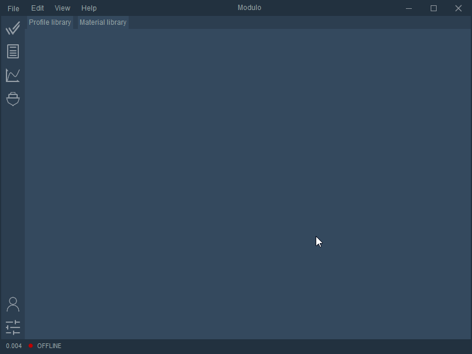

# tkinter_modern_GUI

My attempt to program a modern looking GUI in tkinter / python. 

ps
Don't trust basic tutorials on that - in fact it's quite powerfull. Unfortunately, also lacks many essential features for modern GUI design.

